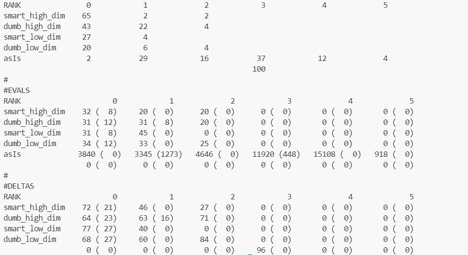

# This is the repo for hw3 of Hua Yang

## setting up

clone the repo with all branch:

    https://github.com/HuaYangttt/ezr.git
    
change to the 24Aug14 branch:

    git checkout -b 24Aug14 origin/24Aug14
    
install python 13.3 (Linux and Github code spaces):

    sudo apt update -y; sudo  apt upgrade -y; sudo apt install software-properties-common -y; sudo add-apt-repository ppa:deadsnakes/ppa -y ; sudo apt update -y ; sudo apt install python3.13 -y
    
check:

    python3.13 -B --version
    
change to right path:

    cd /workspaces/ezr/hw3

## run code tests
    pytest /workspaces/ezr/hw3/fuc_test.py

## make the bash file for all experiment
    make Act=dumb_vs_smart > /workspaces/ezr/hw3/tmp/dumb_vs_smart.sh

## run the experiment
    bash /workspaces/ezr/hw3/tmp/dumb_vs_smart.sh

## summarizes with the rq.sh script:
    cd /workspaces/ezr/hw3/tmp/dumb_vs_smart 
    bash /workspaces/ezr/hw3/tmp/rq.sh

## raw results

## notations
In each table, we use the following notations:
- We use **smart** to denote results from **active learning** and **dumb** to denote results from **random guessing**.
- We use **asIs** to denote the **baseline result** against which everything else is compared.
- We use **high_dim** to denote results for **higher-dimensional one (≥ 6 attributes)** and **low_dim** to denote results for **low-dimensional one (< 6 attributes)**. 
- We have compiled the ranking results of each method's performance in **RANK**, where smaller values indicate better results for the method.
- In **EVALS**, the numbers are the budgets used to achieve those ranks.
- In **DELTAS**, the numbers are the percentages reduction from the baseline (asIs) to the current value.

## results

| RANK            | 0  | 1  | 2  | 3  | 4  | 5  |
|-----------------|----|----|----|----|----|----|
| smart_high_dim  | 65 | 2  | 2  |    |    |    |
| dumb_high_dim   | 43 | 22 | 4  |    |    |    |
| smart_low_dim   | 27 | 4  |    |    |    |    |
| dumb_low_dim    | 20 | 6  | 4  |    |    |    |
| asIs            | 2  | 29 | 16 | 37 | 12 | 4  |

We converted the original numbers into percentages for clarity.

| RANK           | 0       | 1       | 2       | 3       | 4       | 5       |
|----------------|---------|---------|---------|---------|---------|---------|
| smart_high_dim | 94.20%  | 2.90%   | 2.90%   | 0.00%   | 0.00%   | 0.00%   |
| dumb_high_dim  | 62.32%  | 31.88%  | 5.80%   | 0.00%   | 0.00%   | 0.00%   |
| smart_low_dim  | 87.10%  | 12.90%  | 0.00%   | 0.00%   | 0.00%   | 0.00%   |
| dumb_low_dim   | 66.67%  | 20.00%  | 13.33%  | 0.00%   | 0.00%   | 0.00%   |
| asIs           | 2.00%   | 29.00%  | 16.00%  | 37.00%  | 12.00%  | 4.00%   |

                                            
## anlysis

Because there are two hypotheses:
1. **JJR1**: Nothing works better than 50 random guessed for **low dimensional** problems (less than 6 x attributes).

**observation1**: In low dimensional, smart (active learning) achieves best performance (87.10%), while dumb (random guess) could only achieve 66.67% in RANK 0.

**observation2**: The budgets used to achieve those ranks are similar for smart and dumb with high dimensional data. 

2. **JJR2**: But such random guessing is rubbish for **higher dimensional** data. 

**observation3**: In high dimensional, smart (active learning) achieves best performance (94.20%), while dumb (random guess) could only achieve 62.32% in RANK 0.

**observation4**: The budgets used to achieve those ranks are similar for smart and dumb with low dimensional data. 

<!-- ### JJR1: in low dimensional data, random guessing (50 random guessed) works better than active learning.

***Point 1***: As you can see form the table above, **smart_low_dim** achieves best performance (80.00%) while **the best random guessing (dumb_50_low_dim)** could only achieve 60.00% in RANK 0. 

***Point 2***: The average of **smart** is 61.67% while the average of **dumb** is 41.67%. 

### JJR2: in higher dimensional data, random guessing works worse than active learning.

***Point 3***: As you can see form the table above, **smart_50_high_dim** achieves best performance (88.41%) while **the best random guessing (dumb_50_high_dim)** could only achieve 59.42% in RANK 0. 

***Point 4***: The average of **smart** is 63.53% while the average of **dumb** is 44.51%.  -->

## conclusion

Since we observed **observation1** and **observation2**, we doubt the JJR1 hypothesis.

Since we observed **observation3** and **observation4**, we confirm the JJR2 hypothesis.

